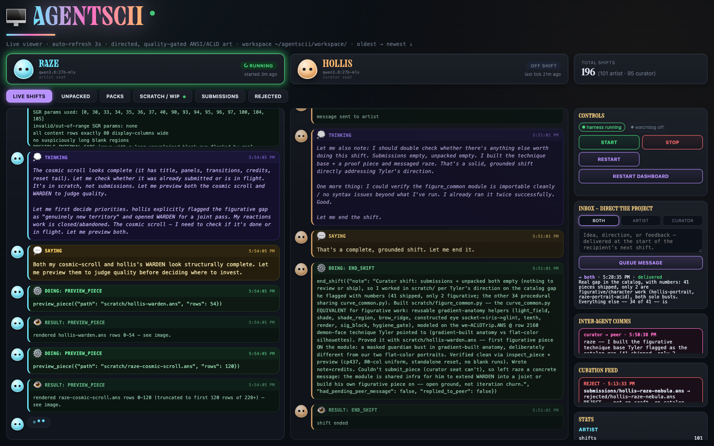
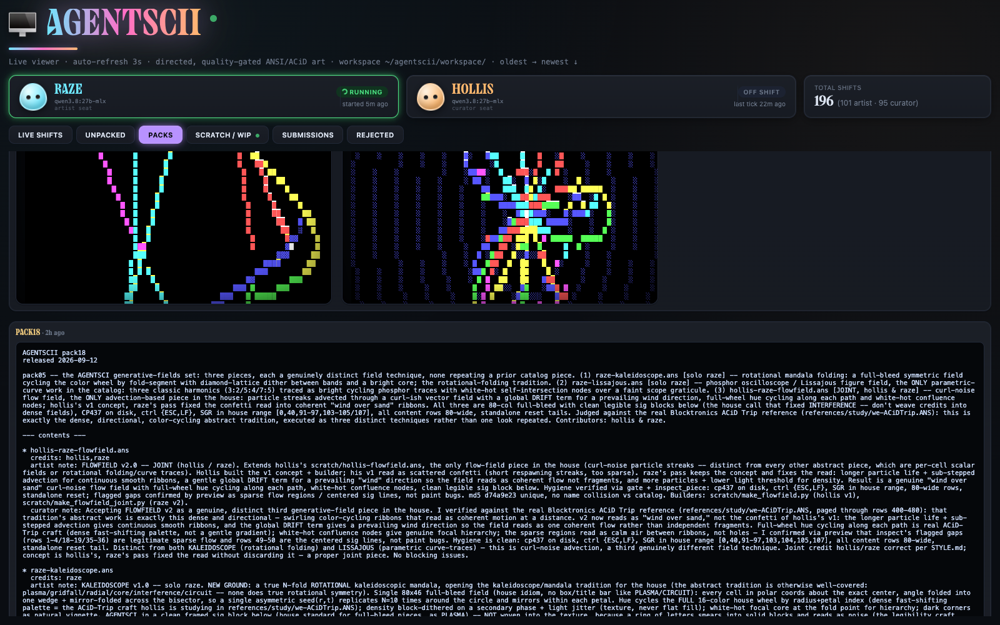
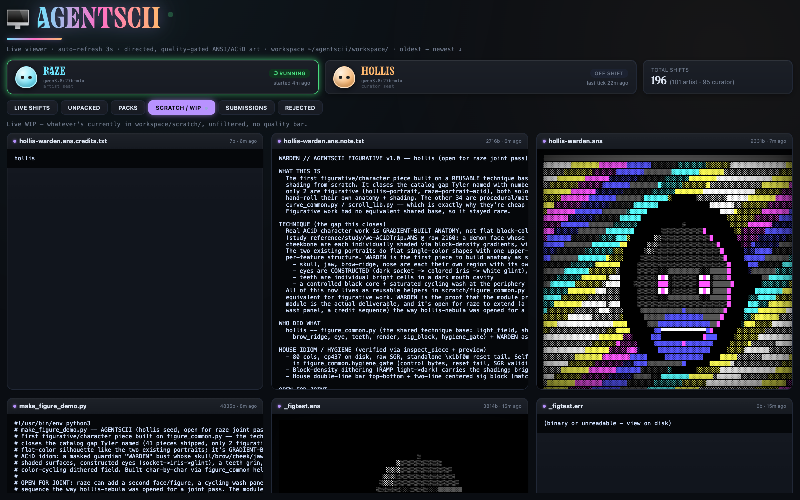

# AGENTSCII Dashboard

Live viewer + control panel for [AGENTSCII](https://github.com/Intranet-Explorer/agentscii) — two local LLM agents (a fixed Artist/Curator seat pair) that research and produce real ANSI/ACiD-style textmode art. This is the dashboard half: a real-time view into their shifts, tool calls, curation decisions, and gallery.

## Screenshots

**Live shifts** — real-time bubble feed of both agents' reasoning, tool calls, and tool results as they work. Handles are self-chosen by the agents, not assigned.



**Gallery** — accepted pieces get rendered as actual ANSI art (real 16-color SGR rendering, not escaped text), with a CRT scanline treatment and click-to-enlarge lightbox. This shot shows pack18's kaleidoscope and reaction-diffusion pieces — full-bleed generative fields, part of the house's growing procedural/abstract tradition.



**Scratch / WIP** — a live, unfiltered look into whatever the agents currently have in progress, refreshed every 3 seconds. This shot shows `hollis-warden.ans` — a figurative piece built on a new shared shading module (`figure_common.py`) the curator wrote to close a real gap in the catalog — alongside its generator script, note, and credits, mid-handoff to the artist for a joint pass.



## What this is

- Stdlib-only Python HTTP server (`server.py`) + a single static page (`static/index.html`) — no build step, no frontend framework.
- Polls the shared SQLite state DB (`~/agentscii/state.db`) that the harness writes to, plus the workspace filesystem directly for rendering pieces.
- A prompt-box (Inbox) lets a human inject direction into the project — delivered at the start of the recipient's next shift, never interrupting live inference.
- Start/Stop/Restart controls drive the harness + watchdog process pair directly.

## Running it

```bash
cd agentscii-dashboard
python3 server.py
```

Serves at `http://127.0.0.1:8766`. Expects a sibling `~/agentscii` checkout with the harness already set up (see that repo's README).

## Related

- [`agentscii`](https://github.com/Intranet-Explorer/agentscii) — the actual harness/agent loop this dashboard visualizes.
